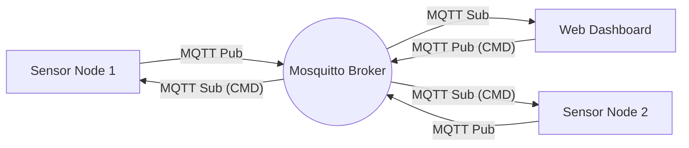

```markdown
# 🌍 End-to-End Distributed IoT Environment Monitor

A distributed IoT system designed to monitor environmental conditions (Temperature & Humidity) in a smart home setting. This project demonstrates a decoupled architecture using **Go (Golang)**, **MQTT**, and **Role-Based Access Control (RBAC)**.


## 📖 Project Overview
The core objective of this project is to move beyond monolithic applications and implement a **Distributed Systems** approach.
* **Decoupling:** Sensors and Dashboard are completely independent, communicating only via the MQTT broker.
* **Concurrency:** Handles real-time data streams using Go routines and channels.
* **Security:** Implements RBAC (Admin vs. User) using secure session cookies.
* **Remote Control:** Simulates RPC over MQTT to allow the Dashboard to remotely "Stop" or "Start" sensors.

## 🏗️ System Architecture

The system consists of three distinct distributed components:



1. **Sensor Nodes (The Edge):** Physics-based simulation generating realistic drifting data.
2. **Message Broker (The Middleware):** Eclipse Mosquitto acting as the central bus.
3. **Web Dashboard (The UI):** A concurrent web server for visualization and control.

## 🚀 Technologies

* **Language:** Go (Golang) v1.21+
* **Middleware:** Eclipse Mosquitto (MQTT Broker)
* **Protocol:** MQTT over TCP (via `paho.mqtt.golang`)
* **Web:** `net/http` with HTML/CSS Templates
* **Data Format:** Lightweight Plain Text payloads

## ⚙️ Installation & Setup

### Prerequisites

* [Go](https://go.dev/dl/) installed on your machine.
* [Mosquitto](https://mosquitto.org/download/) installed and running.

### 1. Clone the Repository

```bash
git clone [https://github.com/ahsanf22/iot-monitor-Distributed-Programming-Project.git](https://github.com/ahsanf22/iot-monitor-Distributed-Programming-Project.git)
cd iot-monitor-Distributed-Programming-Project

```

### 2. Run the System

#### 🐧 Linux / macOS (Automated)

We have provided a launcher script to start all components at once.

```bash
chmod +x run.sh
./run.sh

```

#### 🪟 Windows (Manual)

Since Windows doesn't support bash scripts natively, open **3 separate terminals**:

**Terminal 1 (Dashboard):**

```powershell
cd dashboard
go run main.go

```

**Terminal 2 (Sensor 1):**

```powershell
cd sensor1
go run main.go

```

**Terminal 3 (Sensor 2):**

```powershell
cd sensor2
go run main.go

```

## 🖥️ Usage & Login

Open your browser and navigate to: **http://localhost:8080**

### 🔐 Credentials

| Role | Username | Password | Permissions |
| --- | --- | --- | --- |
| **Admin** | `admin` | `admin123` | View Data + **Control Sensors (Start/Stop)** |
| **User** | `user` | `user123` | **View Only** (Read-Only Access) |

## 👤 Author

**Muhammad Ahsan Khan**

* **Course:** Distributed Programming for Web, IoT, and Mobile Systems
* **University:** University of Florence
* **ID:** 7199916

```

```
